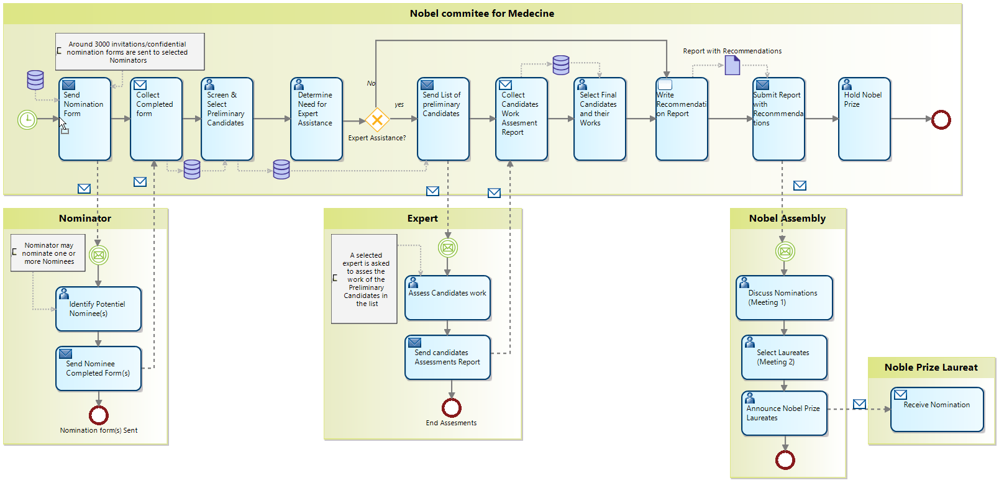

# BPMN Designer

BPMN Designer provides a set of diagrams to work with BPMN 2.0 models. 

These plugins have been created with Eclipse/Sirius and are released under the EPL Open-Source License.

To install it:
- Download OD Community Edition version 11.1: https://www.obeodesigner.com/
- Unzip and start it
- Add the following update sites:
 - http://download.eclipse.org/releases/oxygen/
 - https://s3-eu-west-1.amazonaws.com/obeo-bpmndesigner-releases/4.1.1/repository/
- Install the BPMN-Designer and Sirius Support for Legacy Queries features

To test it, create a new sample project: Ctrl+N > Examples > BPMN > BPMN Samples

You can also download BPMN-Designer installed in Obeo Designer Community edition here: https://github.com/ObeoNetwork/BPMN-Designer/releases/download/4.1.1/BPMNDesigner-4.1.1.zip (Windows version only).
